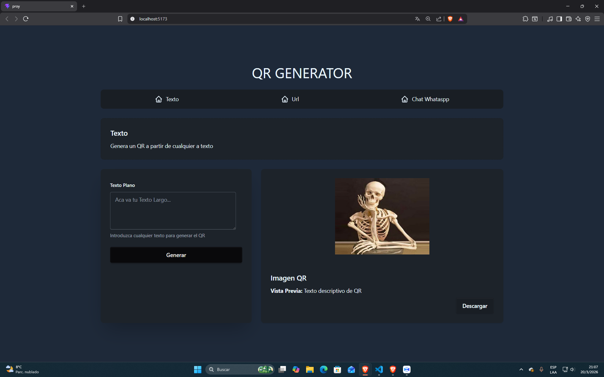
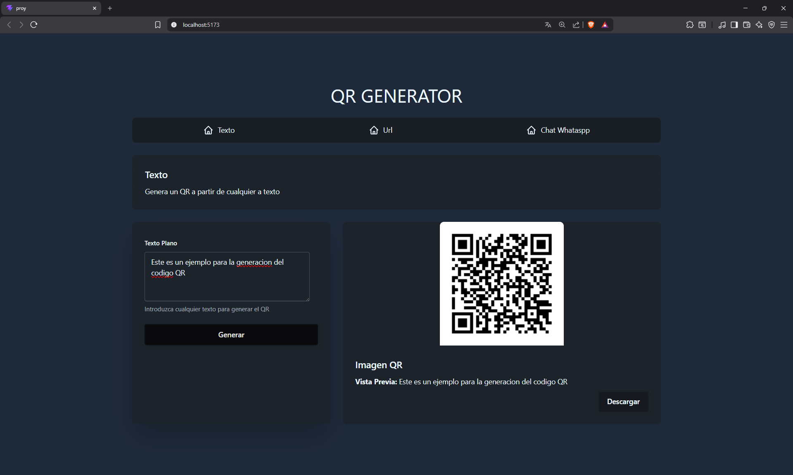
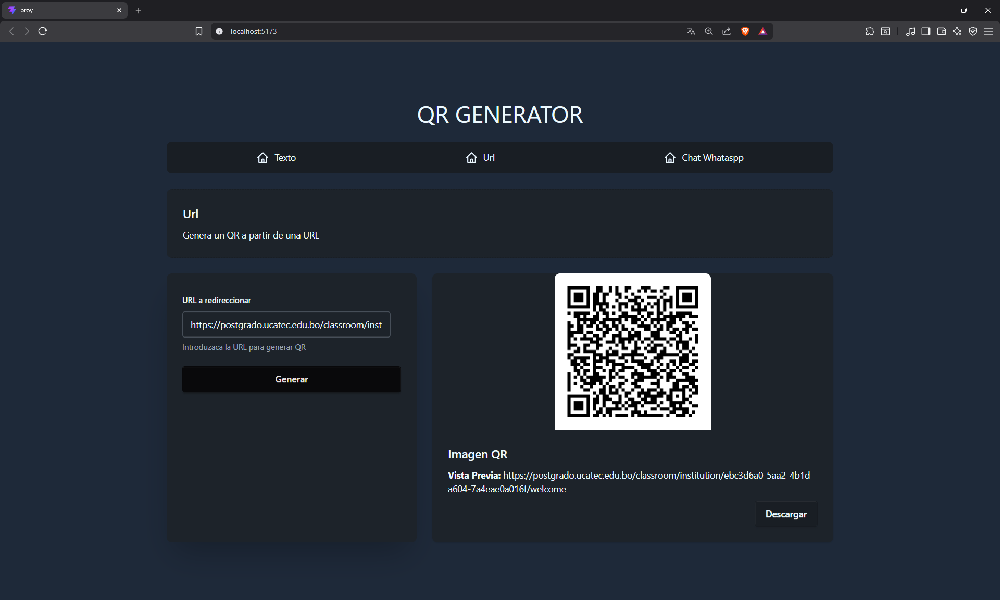
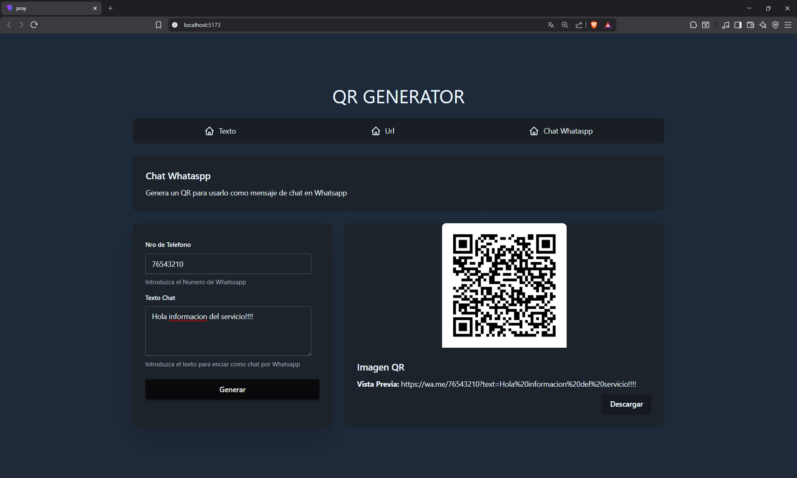

# Generador de Códigos QR

Este proyecto es una aplicación web para generar códigos QR de manera sencilla. Consiste en un backend desarrollado en Node.js con Express y un frontend en React con Vite. Permite generar códigos QR a partir de texto, URLs y enlaces de WhatsApp.

## Imagenes

- **inicio esperando la generacion de QR**
  

- **texto**
  

- **URL**
  

- **Chat**
  

## Características

- **Generación de QR para texto**: Convierte cualquier texto en un código QR.
- **Generación de QR para URLs**: Crea códigos QR que enlazan directamente a páginas web.
- **Generación de QR para WhatsApp**: Genera códigos QR para iniciar chats en WhatsApp con mensajes predefinidos.
- **Interfaz de usuario intuitiva**: Frontend moderno con React y Tailwind CSS.
- **API REST**: Backend con endpoints para generar códigos QR.

## Tecnologías Utilizadas

### Backend

- **Node.js**: Entorno de ejecución.
- **Express**: Framework web para Node.js.
- **qrcode**: Librería para generar códigos QR.
- **CORS**: Para permitir solicitudes desde el frontend.
- **Morgan**: Middleware para logging.
- **Dotenv**: Para variables de entorno.

### Frontend

- **React**: Librería para construir interfaces de usuario.
- **Vite**: Herramienta de desarrollo rápida.
- **Tailwind CSS**: Framework CSS utilitario.
- **DaisyUI**: Componentes UI basados en Tailwind.
- **Axios**: Cliente HTTP para hacer peticiones al backend.

## Instalación

### Prerrequisitos

- Node.js (versión 14 o superior)
- npm o yarn

### Pasos de Instalación

1. Clona el repositorio:

   ```bash
   git clone <url-del-repositorio>
   cd proy
   ```

2. Instala las dependencias del backend:

   ```bash
   cd backend
   npm install
   ```

3. Instala las dependencias del frontend:

   ```bash
   cd ../frontend
   npm install
   ```

4. Regresa al directorio raíz:
   ```bash
   cd ..
   ```

## Uso

### Ejecutar el Backend

Desde el directorio raíz:

```bash
cd backend
npm run dev
```

El servidor se ejecutará en `http://localhost:3000`.

### Ejecutar el Frontend

Desde el directorio raíz:

```bash
cd frontend
npm run dev
```

La aplicación estará disponible en `http://localhost:5173` (puerto por defecto de Vite).

### Uso de la Aplicación

1. Abre el frontend en tu navegador.
2. Selecciona el tipo de QR que deseas generar (Texto, URL o Chat WhatsApp).
3. Ingresa los datos requeridos en el formulario.
4. El código QR se generará y mostrará automáticamente.

## Estructura del Proyecto

```
proy/
├── backend/
│   ├── package.json
│   └── src/
│       ├── app.js          # Servidor Express principal
│       └── example.js      # Función para generar QR
├── frontend/
│   ├── package.json
│   ├── vite.config.js
│   ├── index.html
│   └── src/
│       ├── App.jsx         # Componente principal
│       ├── main.jsx        # Punto de entrada
│       ├── components/
│       │   ├── FormText.jsx    # Formulario para texto
│       │   ├── FormUrl.jsx     # Formulario para URL
│       │   ├── FormChat.jsx    # Formulario para WhatsApp
│       │   └── ui/             # Componentes UI reutilizables
│       └── assets/
└── README.md               # Este archivo
```

## API Endpoints

### GET /qr

Genera un código QR a partir de texto o URL.

**Parámetros de consulta:**

- `text`: Texto a convertir (opcional si se proporciona `url`).
- `url`: URL a convertir (opcional si se proporciona `text`).

**Ejemplo:**

```
GET http://localhost:3000/qr?text=Hola%20Mundo
```

**Respuesta:**

```json
{
  "ok": true,
  "qr": "data:image/png;base64,iVBORw0KGgoAAAANSUhEUgAA..."
}
```

### POST /qr-whatsapp

Genera un código QR para un enlace de WhatsApp.

**Cuerpo de la solicitud:**

```json
{
  "numberPhone": "1234567890",
  "message": "Hola, ¿cómo estás?"
}
```

**Respuesta:**

```json
{
  "ok": true,
  "qr": "data:image/png;base64,iVBORw0KGgoAAAANSUhEUgAA...",
  "message": "Hola, ¿cómo estás?",
  "whatsappLink": "https://wa.me/1234567890?text=Hola%2C%20%C2%BFc%C3%B3mo%20est%C3%A1s%3F"
}
```

## Contribución

1. Haz un fork del proyecto.
2. Crea una rama para tu feature (`git checkout -b feature/nueva-funcionalidad`).
3. Commit tus cambios (`git commit -am 'Agrega nueva funcionalidad'`).
4. Push a la rama (`git push origin feature/nueva-funcionalidad`).
5. Abre un Pull Request.

## Licencia

Este proyecto está bajo la Licencia ISC.
